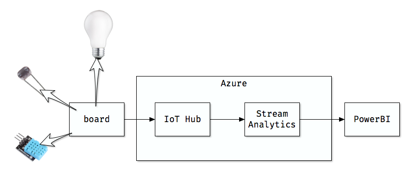

# moonlit

A proof of concept to play out with Arduino, IoT, and Azure. The aim of this project is to turn on a neon at dusk and turn it off after 4 hours. Besides that, I have included a temperature and humidity sensor to gather some weather info. All the data collected by the sensors is sent to Azure to allow us to check it at any moment.

## The big picture:

1. The board sends data to the IoT hub on Azure.
2. The stream analytics job picks these values and inserts them into a PowerBI datasheet
3. A dashboard configured on PowerBi gives us the information about the weather and the relay status.

## What am I using:

* NodeMCU board
* Breadboard
* DHT11 sensor
* Light sensor
* Relay
* Breadboard power supply
* A 10KΩ resistor
* Azure and PowerBI account

## Setting Up Your Computer

I am using [Visual Studio Code](https://code.visualstudio.com) with the [PlatformIO](https://platformio.org) extension to write, compile and deploy the code to the board. I am not an expert on this stuff and I am sure you are able to find a tutorial on the internet much butter from what I can explain here.

Besides, if you are using the same board I am using you will need to install the drivers for your OS.

## The Diagram

## The code

You can find the code in the main file inside the source folder on the repo. The most part of the code was copied from the libraries I am using. The relevant part regarding turning on/off the neon is inside the loop method.

I am not comfortable with this code but it works, I would like to have more time to change some things, maybe to separate part of the code in libraries or find a better way to measure the passing of the time but so far so good.

### Libraries

* [Adafruit_Sensor](https://github.com/adafruit/Adafruit_Sensor?utm_source=platformio&utm_medium=piohome)
* [ArduinoJson](https://github.com/bblanchon/ArduinoJson)
* [AzureIoTHubMQTTClient](https://github.com/andriyadi/AzureIoTHubMQTTClient?utm_source=platformio&utm_medium=piohome)
* [DHT-sensor-library](https://github.com/adafruit/DHT-sensor-library?utm_source=platformio&utm_medium=piohome)
* [Time](https://github.com/PaulStoffregen/Time?utm_source=platformio&utm_medium=piohome)
* [WiFiConnector](https://github.com/cmmakerclub/WiFiConnector?utm_source=platformio&utm_medium=piohome)

## Azure configuration

Again, you can find a ton of information on the internet, this step is only about configuration I haven’t written a line of code to built the dashboard or to process the messages.

I hope the information offered here is useful somehow for you but if you have any question don’t hesitate and let me know.
